# AI Banking Use Cases — Executive AI Transformation Playbook

## Executive Summary

Artificial Intelligence and Data Science are rapidly transforming global banking institutions.  
Leading banks are moving beyond experimentation toward production-grade AI systems that drive measurable business impact across lending, fraud prevention, operations, customer experience, treasury, compliance, and enterprise decision-making.

This document presents **20 consulting-grade AI banking use cases** inspired by real-world implementations across global financial institutions.

The prompts are designed to generate:
- Executive presentation slides
- Consulting-style strategic visuals
- AI transformation roadmaps
- Technical system-design illustrations
- Board-level storytelling assets

The visual language follows:
- McKinsey-style clarity
- Premium banking aesthetics
- Dark enterprise AI themes
- Modern system architecture storytelling
- Practical operational realism

---

# Design Standards

## Visual Style
- 16:9 widescreen
- Dark premium banking background
- Cyan / electric-blue enterprise AI glow
- Minimal but information-dense layout
- Consulting-grade hierarchy
- Enterprise realism

## Branding
Use the DataLearn branding system:
- subtle watermark
- bottom-right placement
- professional consulting aesthetic

## Recommended AI Image Models
- ChatGPT Image
- Midjourney
- Flux
- Ideogram
- Stable Diffusion XL

---

# File Naming Convention


## Recommended Folder Structure

```text
project/
│
├── ai_banking_use_cases.md
│
└── images/
    ├── ai_banking_use_cases_01.png
    ├── ai_banking_use_cases_02.png
    ├── ...
    └── ai_banking_use_cases_20.png
```

---


Generated images should follow the naming structure below:

```text
images/ai_banking_use_cases_01.png
images/ai_banking_use_cases_02.png
...
images/ai_banking_use_cases_20.png
```

---

# Table of Contents

| Slide | Section | Title | Image |
|---:|---|---|---|
| 01 | Executive Overview | AI & Data Science in Banking — Executive Agenda | `images/ai_banking_use_cases_01.png` |
| 02 | Risk & Credit | Real-Time Credit Scoring | `images/ai_banking_use_cases_02.png` |
| 03 | Risk & Credit | Early Warning System (EWS) | `images/ai_banking_use_cases_03.png` |
| 04 | Risk & Credit | Credit Limit Optimization | `images/ai_banking_use_cases_04.png` |
| 05 | Risk & Credit | Income Estimation from Banking Behavior | `images/ai_banking_use_cases_05.png` |
| 06 | Fraud & AML | Real-Time Fraud Detection | `images/ai_banking_use_cases_06.png` |
| 07 | Fraud & AML | Graph AI for Fraud Ring Detection | `images/ai_banking_use_cases_07.png` |
| 08 | Fraud & AML | AI-Powered AML Monitoring | `images/ai_banking_use_cases_08.png` |
| 09 | Customer & Marketing | Next Best Offer Engine | `images/ai_banking_use_cases_09.png` |
| 10 | Customer & Marketing | Customer Churn Prediction | `images/ai_banking_use_cases_10.png` |
| 11 | Customer & Marketing | Risk-Based Pricing | `images/ai_banking_use_cases_11.png` |
| 12 | Operations & AI Automation | Document AI for Banking Operations | `images/ai_banking_use_cases_12.png` |
| 13 | Operations & AI Automation | AI Copilot for Call Centers | `images/ai_banking_use_cases_13.png` |
| 14 | Operations & AI Automation | Enterprise Banking Knowledge Assistant | `images/ai_banking_use_cases_14.png` |
| 15 | Treasury & Capital Markets | Real-Time Market Risk Monitoring | `images/ai_banking_use_cases_15.png` |
| 16 | Treasury & Capital Markets | Liquidity Forecasting with Machine Learning | `images/ai_banking_use_cases_16.png` |
| 17 | AI Governance & MRM | Model Risk Management for AI Systems | `images/ai_banking_use_cases_17.png` |
| 18 | AI Governance & MRM | Evaluating LLM Systems in Banking | `images/ai_banking_use_cases_18.png` |
| 19 | Enterprise AI Transformation | How Banks Actually Scale AI | `images/ai_banking_use_cases_19.png` |
| 20 | Enterprise AI Transformation | The AI-Native Bank | `images/ai_banking_use_cases_20.png` |


---

# Slide 01 — AI & Data Science in Banking — Executive Agenda

## Section
Executive Overview

## Purpose
This slide illustrates a practical enterprise AI use case used by modern financial institutions to improve operational efficiency, customer intelligence, risk management, or strategic decision-making.

## Recommended Visual Goal
Create a boardroom-quality consulting visual that combines:
- business storytelling
- AI architecture thinking
- measurable business outcomes
- operational realism
- enterprise banking aesthetics

## Suggested Image File
```text
images/ai_banking_use_cases_01.png
```

## Image Placeholder

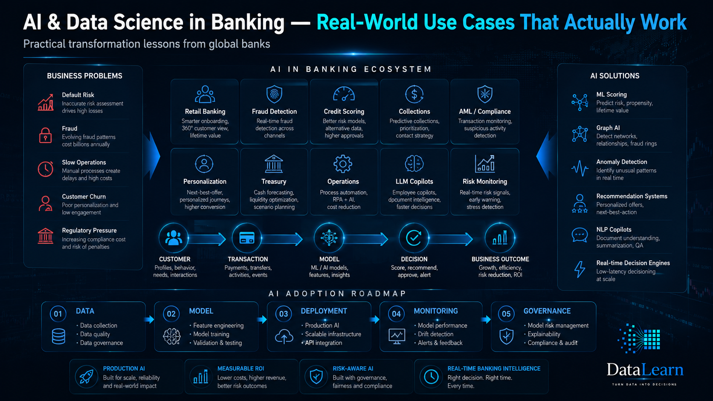

## Copy-Ready Prompt

```text
Create a premium consulting-style AI-generated banking transformation slide.

TITLE:
AI & Data Science in Banking — Executive Agenda

STYLE:
- McKinsey-style executive storytelling
- Dark premium banking aesthetic
- Cyan and electric-blue enterprise AI glow
- Modern system-design visual language
- 16:9 widescreen
- Clean information hierarchy
- Professional banking realism
- Bloomberg + enterprise AI atmosphere

CORE REQUIREMENTS:
- show measurable business value
- realistic operational constraints
- production-grade AI systems
- executive-ready visual storytelling
- modern banking transformation aesthetics

VISUAL ELEMENTS:
- enterprise AI workflows
- customer intelligence systems
- decision engines
- monitoring dashboards
- intelligent automation
- risk management layers
- data pipelines
- production infrastructure

ANNOTATIONS:
- measurable ROI
- production AI
- governance
- scalability
- explainability
- operational efficiency

BOTTOM-RIGHT:
Add subtle DataLearn watermark.

FINAL FEEL:
The visual should look like it belongs inside a top-tier McKinsey, BCG, or Accenture AI transformation presentation for global banks.
```

## Executive Commentary

This use case represents a major transformation opportunity for banks seeking to become more data-driven, intelligent, scalable, and operationally resilient. Successful implementation requires:
- strong data foundations
- business sponsorship
- MLOps maturity
- governance frameworks
- continuous monitoring
- measurable KPI ownership

Typical enterprise KPIs include:
- revenue uplift
- fraud reduction
- lower operational cost
- faster decision-making
- improved customer experience
- better portfolio quality


---

# Slide 02 — Real-Time Credit Scoring

## Section
Risk & Credit

## Purpose
This slide illustrates a practical enterprise AI use case used by modern financial institutions to improve operational efficiency, customer intelligence, risk management, or strategic decision-making.

## Recommended Visual Goal
Create a boardroom-quality consulting visual that combines:
- business storytelling
- AI architecture thinking
- measurable business outcomes
- operational realism
- enterprise banking aesthetics

## Suggested Image File
```text
images/ai_banking_use_cases_02.png
```

## Image Placeholder

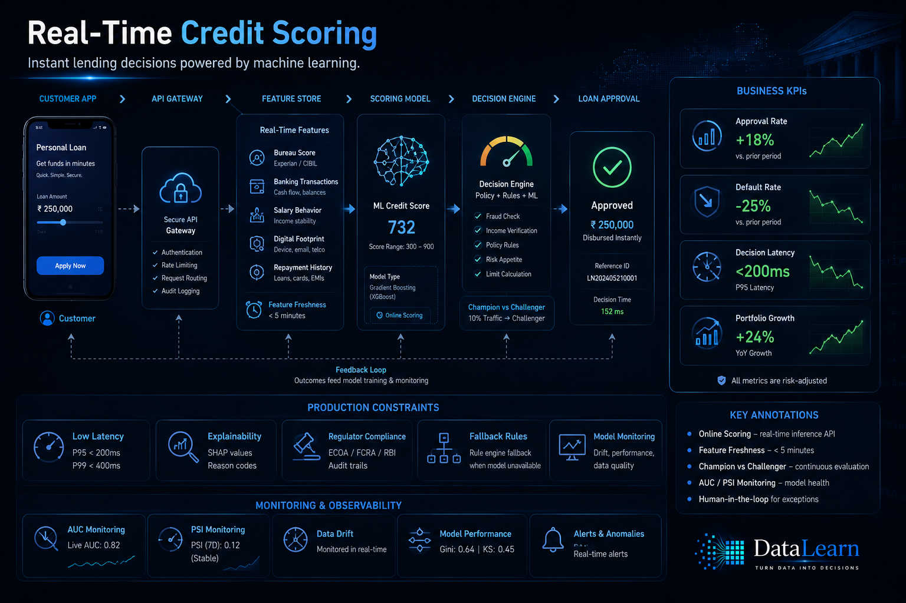

## Copy-Ready Prompt

```text
Create a premium consulting-style AI-generated banking transformation slide.

TITLE:
Real-Time Credit Scoring

STYLE:
- McKinsey-style executive storytelling
- Dark premium banking aesthetic
- Cyan and electric-blue enterprise AI glow
- Modern system-design visual language
- 16:9 widescreen
- Clean information hierarchy
- Professional banking realism
- Bloomberg + enterprise AI atmosphere

CORE REQUIREMENTS:
- show measurable business value
- realistic operational constraints
- production-grade AI systems
- executive-ready visual storytelling
- modern banking transformation aesthetics

VISUAL ELEMENTS:
- enterprise AI workflows
- customer intelligence systems
- decision engines
- monitoring dashboards
- intelligent automation
- risk management layers
- data pipelines
- production infrastructure

ANNOTATIONS:
- measurable ROI
- production AI
- governance
- scalability
- explainability
- operational efficiency

BOTTOM-RIGHT:
Add subtle DataLearn watermark.

FINAL FEEL:
The visual should look like it belongs inside a top-tier McKinsey, BCG, or Accenture AI transformation presentation for global banks.
```

## Executive Commentary

This use case represents a major transformation opportunity for banks seeking to become more data-driven, intelligent, scalable, and operationally resilient. Successful implementation requires:
- strong data foundations
- business sponsorship
- MLOps maturity
- governance frameworks
- continuous monitoring
- measurable KPI ownership

Typical enterprise KPIs include:
- revenue uplift
- fraud reduction
- lower operational cost
- faster decision-making
- improved customer experience
- better portfolio quality


---

# Slide 03 — Early Warning System (EWS)

## Section
Risk & Credit

## Purpose
This slide illustrates a practical enterprise AI use case used by modern financial institutions to improve operational efficiency, customer intelligence, risk management, or strategic decision-making.

## Recommended Visual Goal
Create a boardroom-quality consulting visual that combines:
- business storytelling
- AI architecture thinking
- measurable business outcomes
- operational realism
- enterprise banking aesthetics

## Suggested Image File
```text
images/ai_banking_use_cases_03.png
```

## Image Placeholder

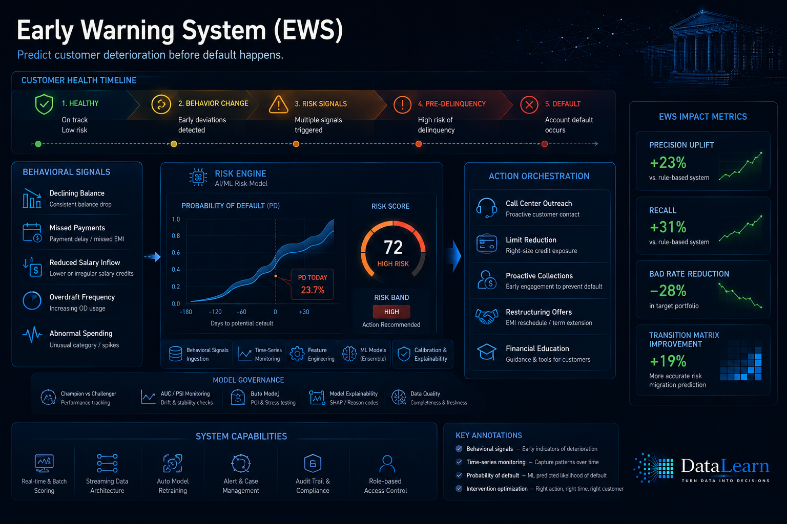

## Copy-Ready Prompt

```text
Create a premium consulting-style AI-generated banking transformation slide.

TITLE:
Early Warning System (EWS)

STYLE:
- McKinsey-style executive storytelling
- Dark premium banking aesthetic
- Cyan and electric-blue enterprise AI glow
- Modern system-design visual language
- 16:9 widescreen
- Clean information hierarchy
- Professional banking realism
- Bloomberg + enterprise AI atmosphere

CORE REQUIREMENTS:
- show measurable business value
- realistic operational constraints
- production-grade AI systems
- executive-ready visual storytelling
- modern banking transformation aesthetics

VISUAL ELEMENTS:
- enterprise AI workflows
- customer intelligence systems
- decision engines
- monitoring dashboards
- intelligent automation
- risk management layers
- data pipelines
- production infrastructure

ANNOTATIONS:
- measurable ROI
- production AI
- governance
- scalability
- explainability
- operational efficiency

BOTTOM-RIGHT:
Add subtle DataLearn watermark.

FINAL FEEL:
The visual should look like it belongs inside a top-tier McKinsey, BCG, or Accenture AI transformation presentation for global banks.
```

## Executive Commentary

This use case represents a major transformation opportunity for banks seeking to become more data-driven, intelligent, scalable, and operationally resilient. Successful implementation requires:
- strong data foundations
- business sponsorship
- MLOps maturity
- governance frameworks
- continuous monitoring
- measurable KPI ownership

Typical enterprise KPIs include:
- revenue uplift
- fraud reduction
- lower operational cost
- faster decision-making
- improved customer experience
- better portfolio quality


---

# Slide 04 — Credit Limit Optimization

## Section
Risk & Credit

## Purpose
This slide illustrates a practical enterprise AI use case used by modern financial institutions to improve operational efficiency, customer intelligence, risk management, or strategic decision-making.

## Recommended Visual Goal
Create a boardroom-quality consulting visual that combines:
- business storytelling
- AI architecture thinking
- measurable business outcomes
- operational realism
- enterprise banking aesthetics

## Suggested Image File
```text
images/ai_banking_use_cases_04.png
```

## Image Placeholder

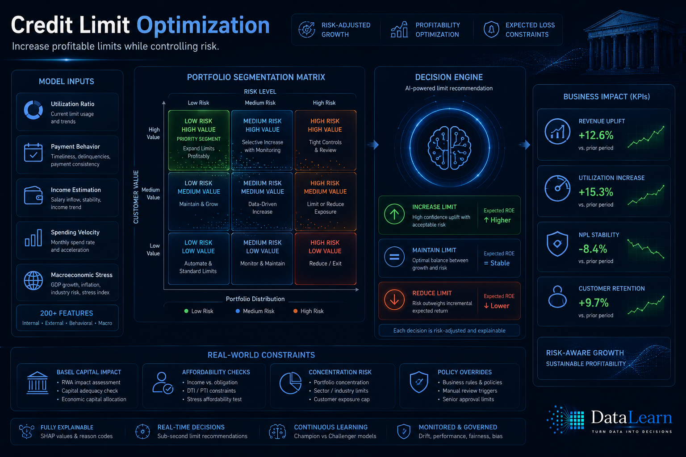

## Copy-Ready Prompt

```text
Create a premium consulting-style AI-generated banking transformation slide.

TITLE:
Credit Limit Optimization

STYLE:
- McKinsey-style executive storytelling
- Dark premium banking aesthetic
- Cyan and electric-blue enterprise AI glow
- Modern system-design visual language
- 16:9 widescreen
- Clean information hierarchy
- Professional banking realism
- Bloomberg + enterprise AI atmosphere

CORE REQUIREMENTS:
- show measurable business value
- realistic operational constraints
- production-grade AI systems
- executive-ready visual storytelling
- modern banking transformation aesthetics

VISUAL ELEMENTS:
- enterprise AI workflows
- customer intelligence systems
- decision engines
- monitoring dashboards
- intelligent automation
- risk management layers
- data pipelines
- production infrastructure

ANNOTATIONS:
- measurable ROI
- production AI
- governance
- scalability
- explainability
- operational efficiency

BOTTOM-RIGHT:
Add subtle DataLearn watermark.

FINAL FEEL:
The visual should look like it belongs inside a top-tier McKinsey, BCG, or Accenture AI transformation presentation for global banks.
```

## Executive Commentary

This use case represents a major transformation opportunity for banks seeking to become more data-driven, intelligent, scalable, and operationally resilient. Successful implementation requires:
- strong data foundations
- business sponsorship
- MLOps maturity
- governance frameworks
- continuous monitoring
- measurable KPI ownership

Typical enterprise KPIs include:
- revenue uplift
- fraud reduction
- lower operational cost
- faster decision-making
- improved customer experience
- better portfolio quality


---

# Slide 05 — Income Estimation from Banking Behavior

## Section
Risk & Credit

## Purpose
This slide illustrates a practical enterprise AI use case used by modern financial institutions to improve operational efficiency, customer intelligence, risk management, or strategic decision-making.

## Recommended Visual Goal
Create a boardroom-quality consulting visual that combines:
- business storytelling
- AI architecture thinking
- measurable business outcomes
- operational realism
- enterprise banking aesthetics

## Suggested Image File
```text
images/ai_banking_use_cases_05.png
```

## Image Placeholder

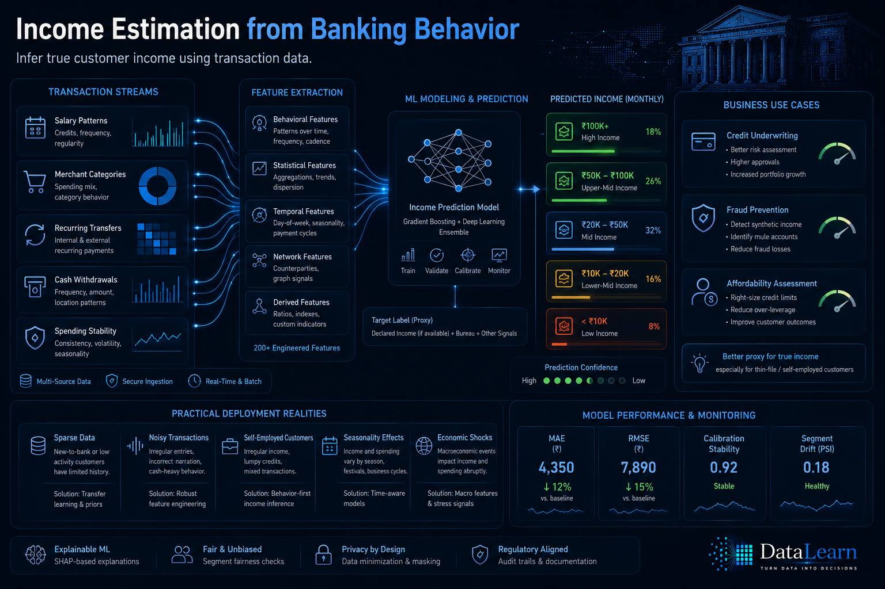

## Copy-Ready Prompt

```text
Create a premium consulting-style AI-generated banking transformation slide.

TITLE:
Income Estimation from Banking Behavior

STYLE:
- McKinsey-style executive storytelling
- Dark premium banking aesthetic
- Cyan and electric-blue enterprise AI glow
- Modern system-design visual language
- 16:9 widescreen
- Clean information hierarchy
- Professional banking realism
- Bloomberg + enterprise AI atmosphere

CORE REQUIREMENTS:
- show measurable business value
- realistic operational constraints
- production-grade AI systems
- executive-ready visual storytelling
- modern banking transformation aesthetics

VISUAL ELEMENTS:
- enterprise AI workflows
- customer intelligence systems
- decision engines
- monitoring dashboards
- intelligent automation
- risk management layers
- data pipelines
- production infrastructure

ANNOTATIONS:
- measurable ROI
- production AI
- governance
- scalability
- explainability
- operational efficiency

BOTTOM-RIGHT:
Add subtle DataLearn watermark.

FINAL FEEL:
The visual should look like it belongs inside a top-tier McKinsey, BCG, or Accenture AI transformation presentation for global banks.
```

## Executive Commentary

This use case represents a major transformation opportunity for banks seeking to become more data-driven, intelligent, scalable, and operationally resilient. Successful implementation requires:
- strong data foundations
- business sponsorship
- MLOps maturity
- governance frameworks
- continuous monitoring
- measurable KPI ownership

Typical enterprise KPIs include:
- revenue uplift
- fraud reduction
- lower operational cost
- faster decision-making
- improved customer experience
- better portfolio quality


---

# Slide 06 — Real-Time Fraud Detection

## Section
Fraud & AML

## Purpose
This slide illustrates a practical enterprise AI use case used by modern financial institutions to improve operational efficiency, customer intelligence, risk management, or strategic decision-making.

## Recommended Visual Goal
Create a boardroom-quality consulting visual that combines:
- business storytelling
- AI architecture thinking
- measurable business outcomes
- operational realism
- enterprise banking aesthetics

## Suggested Image File
```text
images/ai_banking_use_cases_06.png
```

## Image Placeholder

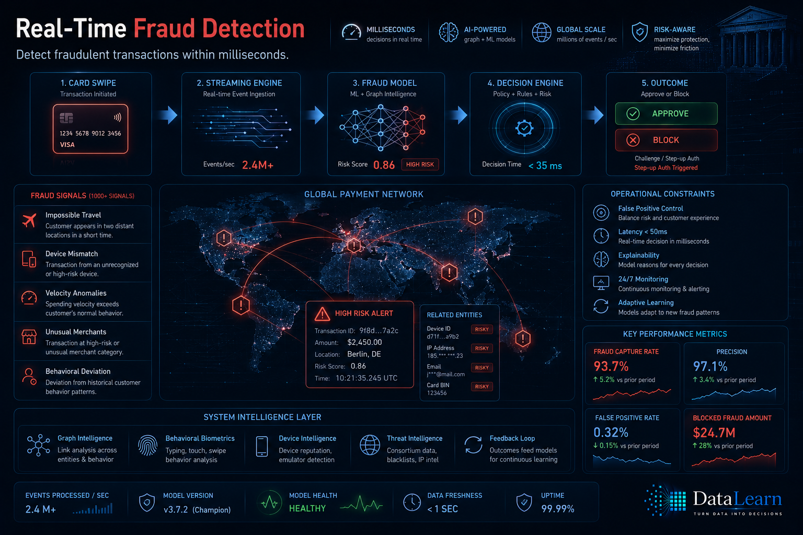

## Copy-Ready Prompt

```text
Create a premium consulting-style AI-generated banking transformation slide.

TITLE:
Real-Time Fraud Detection

STYLE:
- McKinsey-style executive storytelling
- Dark premium banking aesthetic
- Cyan and electric-blue enterprise AI glow
- Modern system-design visual language
- 16:9 widescreen
- Clean information hierarchy
- Professional banking realism
- Bloomberg + enterprise AI atmosphere

CORE REQUIREMENTS:
- show measurable business value
- realistic operational constraints
- production-grade AI systems
- executive-ready visual storytelling
- modern banking transformation aesthetics

VISUAL ELEMENTS:
- enterprise AI workflows
- customer intelligence systems
- decision engines
- monitoring dashboards
- intelligent automation
- risk management layers
- data pipelines
- production infrastructure

ANNOTATIONS:
- measurable ROI
- production AI
- governance
- scalability
- explainability
- operational efficiency

BOTTOM-RIGHT:
Add subtle DataLearn watermark.

FINAL FEEL:
The visual should look like it belongs inside a top-tier McKinsey, BCG, or Accenture AI transformation presentation for global banks.
```

## Executive Commentary

This use case represents a major transformation opportunity for banks seeking to become more data-driven, intelligent, scalable, and operationally resilient. Successful implementation requires:
- strong data foundations
- business sponsorship
- MLOps maturity
- governance frameworks
- continuous monitoring
- measurable KPI ownership

Typical enterprise KPIs include:
- revenue uplift
- fraud reduction
- lower operational cost
- faster decision-making
- improved customer experience
- better portfolio quality


---

# Slide 07 — Graph AI for Fraud Ring Detection

## Section
Fraud & AML

## Purpose
This slide illustrates a practical enterprise AI use case used by modern financial institutions to improve operational efficiency, customer intelligence, risk management, or strategic decision-making.

## Recommended Visual Goal
Create a boardroom-quality consulting visual that combines:
- business storytelling
- AI architecture thinking
- measurable business outcomes
- operational realism
- enterprise banking aesthetics

## Suggested Image File
```text
images/ai_banking_use_cases_07.png
```

## Image Placeholder

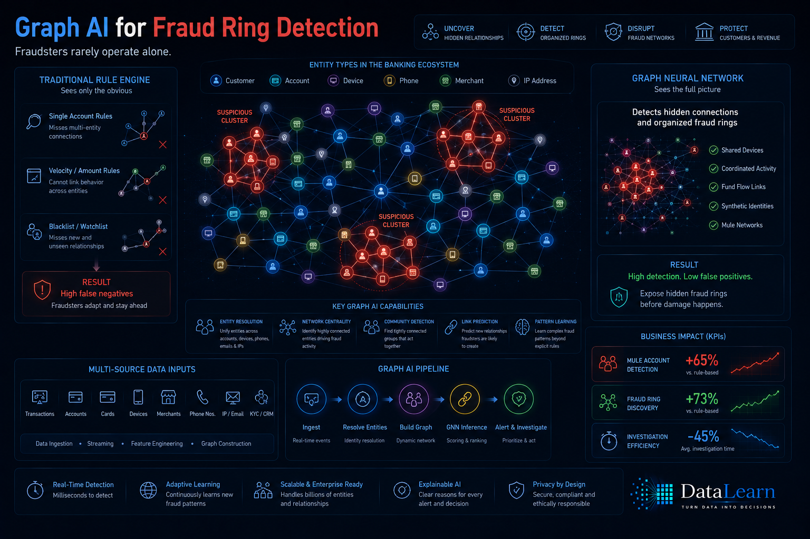

## Copy-Ready Prompt

```text
Create a premium consulting-style AI-generated banking transformation slide.

TITLE:
Graph AI for Fraud Ring Detection

STYLE:
- McKinsey-style executive storytelling
- Dark premium banking aesthetic
- Cyan and electric-blue enterprise AI glow
- Modern system-design visual language
- 16:9 widescreen
- Clean information hierarchy
- Professional banking realism
- Bloomberg + enterprise AI atmosphere

CORE REQUIREMENTS:
- show measurable business value
- realistic operational constraints
- production-grade AI systems
- executive-ready visual storytelling
- modern banking transformation aesthetics

VISUAL ELEMENTS:
- enterprise AI workflows
- customer intelligence systems
- decision engines
- monitoring dashboards
- intelligent automation
- risk management layers
- data pipelines
- production infrastructure

ANNOTATIONS:
- measurable ROI
- production AI
- governance
- scalability
- explainability
- operational efficiency

BOTTOM-RIGHT:
Add subtle DataLearn watermark.

FINAL FEEL:
The visual should look like it belongs inside a top-tier McKinsey, BCG, or Accenture AI transformation presentation for global banks.
```

## Executive Commentary

This use case represents a major transformation opportunity for banks seeking to become more data-driven, intelligent, scalable, and operationally resilient. Successful implementation requires:
- strong data foundations
- business sponsorship
- MLOps maturity
- governance frameworks
- continuous monitoring
- measurable KPI ownership

Typical enterprise KPIs include:
- revenue uplift
- fraud reduction
- lower operational cost
- faster decision-making
- improved customer experience
- better portfolio quality


---

# Slide 08 — AI-Powered AML Monitoring

## Section
Fraud & AML

## Purpose
This slide illustrates a practical enterprise AI use case used by modern financial institutions to improve operational efficiency, customer intelligence, risk management, or strategic decision-making.

## Recommended Visual Goal
Create a boardroom-quality consulting visual that combines:
- business storytelling
- AI architecture thinking
- measurable business outcomes
- operational realism
- enterprise banking aesthetics

## Suggested Image File
```text
images/ai_banking_use_cases_08.png
```

## Image Placeholder

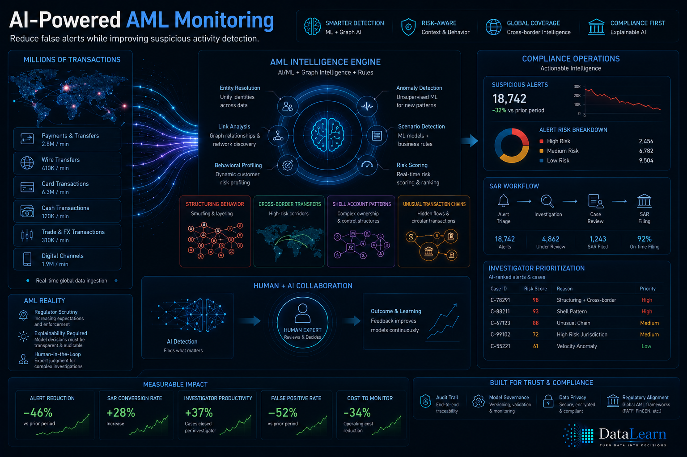

## Copy-Ready Prompt

```text
Create a premium consulting-style AI-generated banking transformation slide.

TITLE:
AI-Powered AML Monitoring

STYLE:
- McKinsey-style executive storytelling
- Dark premium banking aesthetic
- Cyan and electric-blue enterprise AI glow
- Modern system-design visual language
- 16:9 widescreen
- Clean information hierarchy
- Professional banking realism
- Bloomberg + enterprise AI atmosphere

CORE REQUIREMENTS:
- show measurable business value
- realistic operational constraints
- production-grade AI systems
- executive-ready visual storytelling
- modern banking transformation aesthetics

VISUAL ELEMENTS:
- enterprise AI workflows
- customer intelligence systems
- decision engines
- monitoring dashboards
- intelligent automation
- risk management layers
- data pipelines
- production infrastructure

ANNOTATIONS:
- measurable ROI
- production AI
- governance
- scalability
- explainability
- operational efficiency

BOTTOM-RIGHT:
Add subtle DataLearn watermark.

FINAL FEEL:
The visual should look like it belongs inside a top-tier McKinsey, BCG, or Accenture AI transformation presentation for global banks.
```

## Executive Commentary

This use case represents a major transformation opportunity for banks seeking to become more data-driven, intelligent, scalable, and operationally resilient. Successful implementation requires:
- strong data foundations
- business sponsorship
- MLOps maturity
- governance frameworks
- continuous monitoring
- measurable KPI ownership

Typical enterprise KPIs include:
- revenue uplift
- fraud reduction
- lower operational cost
- faster decision-making
- improved customer experience
- better portfolio quality


---

# Slide 09 — Next Best Offer Engine

## Section
Customer & Marketing

## Purpose
This slide illustrates a practical enterprise AI use case used by modern financial institutions to improve operational efficiency, customer intelligence, risk management, or strategic decision-making.

## Recommended Visual Goal
Create a boardroom-quality consulting visual that combines:
- business storytelling
- AI architecture thinking
- measurable business outcomes
- operational realism
- enterprise banking aesthetics

## Suggested Image File
```text
images/ai_banking_use_cases_09.png
```

## Image Placeholder

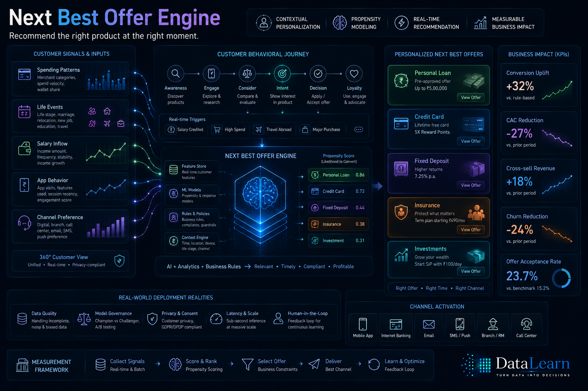

## Copy-Ready Prompt

```text
Create a premium consulting-style AI-generated banking transformation slide.

TITLE:
Next Best Offer Engine

STYLE:
- McKinsey-style executive storytelling
- Dark premium banking aesthetic
- Cyan and electric-blue enterprise AI glow
- Modern system-design visual language
- 16:9 widescreen
- Clean information hierarchy
- Professional banking realism
- Bloomberg + enterprise AI atmosphere

CORE REQUIREMENTS:
- show measurable business value
- realistic operational constraints
- production-grade AI systems
- executive-ready visual storytelling
- modern banking transformation aesthetics

VISUAL ELEMENTS:
- enterprise AI workflows
- customer intelligence systems
- decision engines
- monitoring dashboards
- intelligent automation
- risk management layers
- data pipelines
- production infrastructure

ANNOTATIONS:
- measurable ROI
- production AI
- governance
- scalability
- explainability
- operational efficiency

BOTTOM-RIGHT:
Add subtle DataLearn watermark.

FINAL FEEL:
The visual should look like it belongs inside a top-tier McKinsey, BCG, or Accenture AI transformation presentation for global banks.
```

## Executive Commentary

This use case represents a major transformation opportunity for banks seeking to become more data-driven, intelligent, scalable, and operationally resilient. Successful implementation requires:
- strong data foundations
- business sponsorship
- MLOps maturity
- governance frameworks
- continuous monitoring
- measurable KPI ownership

Typical enterprise KPIs include:
- revenue uplift
- fraud reduction
- lower operational cost
- faster decision-making
- improved customer experience
- better portfolio quality


---

# Slide 10 — Customer Churn Prediction

## Section
Customer & Marketing

## Purpose
This slide illustrates a practical enterprise AI use case used by modern financial institutions to improve operational efficiency, customer intelligence, risk management, or strategic decision-making.

## Recommended Visual Goal
Create a boardroom-quality consulting visual that combines:
- business storytelling
- AI architecture thinking
- measurable business outcomes
- operational realism
- enterprise banking aesthetics

## Suggested Image File
```text
images/ai_banking_use_cases_10.png
```

## Image Placeholder

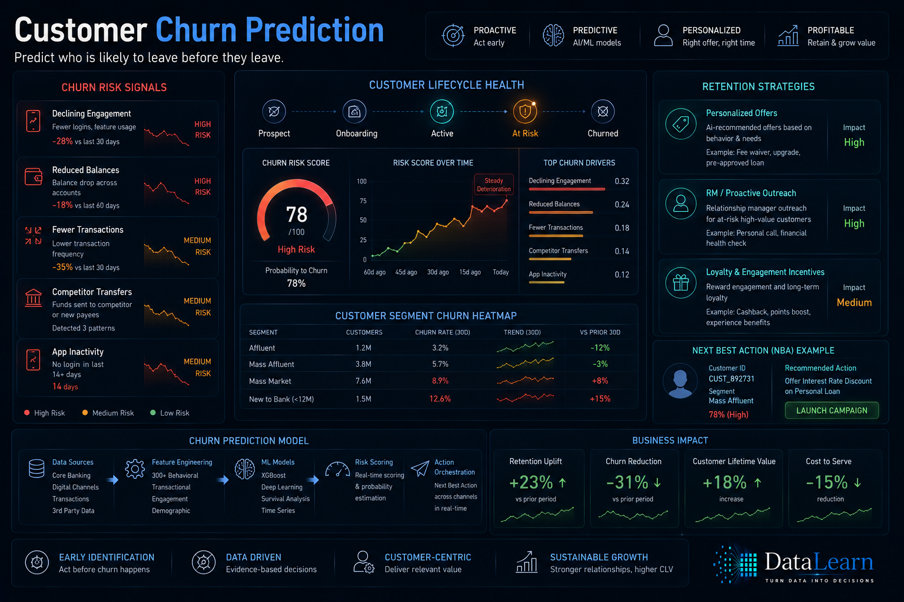

## Copy-Ready Prompt

```text
Create a premium consulting-style AI-generated banking transformation slide.

TITLE:
Customer Churn Prediction

STYLE:
- McKinsey-style executive storytelling
- Dark premium banking aesthetic
- Cyan and electric-blue enterprise AI glow
- Modern system-design visual language
- 16:9 widescreen
- Clean information hierarchy
- Professional banking realism
- Bloomberg + enterprise AI atmosphere

CORE REQUIREMENTS:
- show measurable business value
- realistic operational constraints
- production-grade AI systems
- executive-ready visual storytelling
- modern banking transformation aesthetics

VISUAL ELEMENTS:
- enterprise AI workflows
- customer intelligence systems
- decision engines
- monitoring dashboards
- intelligent automation
- risk management layers
- data pipelines
- production infrastructure

ANNOTATIONS:
- measurable ROI
- production AI
- governance
- scalability
- explainability
- operational efficiency

BOTTOM-RIGHT:
Add subtle DataLearn watermark.

FINAL FEEL:
The visual should look like it belongs inside a top-tier McKinsey, BCG, or Accenture AI transformation presentation for global banks.
```

## Executive Commentary

This use case represents a major transformation opportunity for banks seeking to become more data-driven, intelligent, scalable, and operationally resilient. Successful implementation requires:
- strong data foundations
- business sponsorship
- MLOps maturity
- governance frameworks
- continuous monitoring
- measurable KPI ownership

Typical enterprise KPIs include:
- revenue uplift
- fraud reduction
- lower operational cost
- faster decision-making
- improved customer experience
- better portfolio quality


---

# Slide 11 — Risk-Based Pricing

## Section
Customer & Marketing

## Purpose
This slide illustrates a practical enterprise AI use case used by modern financial institutions to improve operational efficiency, customer intelligence, risk management, or strategic decision-making.

## Recommended Visual Goal
Create a boardroom-quality consulting visual that combines:
- business storytelling
- AI architecture thinking
- measurable business outcomes
- operational realism
- enterprise banking aesthetics

## Suggested Image File
```text
images/ai_banking_use_cases_11.png
```

## Image Placeholder

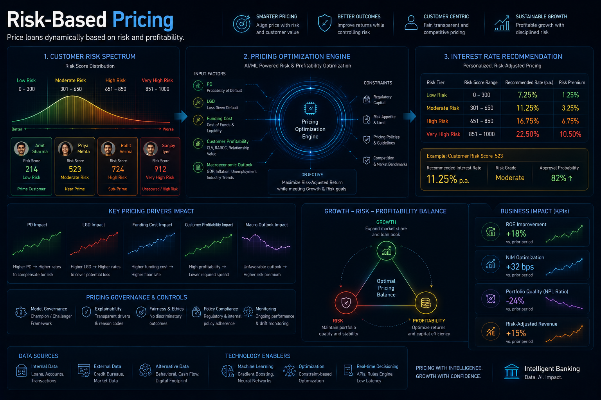

## Copy-Ready Prompt

```text
Create a premium consulting-style AI-generated banking transformation slide.

TITLE:
Risk-Based Pricing

STYLE:
- McKinsey-style executive storytelling
- Dark premium banking aesthetic
- Cyan and electric-blue enterprise AI glow
- Modern system-design visual language
- 16:9 widescreen
- Clean information hierarchy
- Professional banking realism
- Bloomberg + enterprise AI atmosphere

CORE REQUIREMENTS:
- show measurable business value
- realistic operational constraints
- production-grade AI systems
- executive-ready visual storytelling
- modern banking transformation aesthetics

VISUAL ELEMENTS:
- enterprise AI workflows
- customer intelligence systems
- decision engines
- monitoring dashboards
- intelligent automation
- risk management layers
- data pipelines
- production infrastructure

ANNOTATIONS:
- measurable ROI
- production AI
- governance
- scalability
- explainability
- operational efficiency

BOTTOM-RIGHT:
Add subtle DataLearn watermark.

FINAL FEEL:
The visual should look like it belongs inside a top-tier McKinsey, BCG, or Accenture AI transformation presentation for global banks.
```

## Executive Commentary

This use case represents a major transformation opportunity for banks seeking to become more data-driven, intelligent, scalable, and operationally resilient. Successful implementation requires:
- strong data foundations
- business sponsorship
- MLOps maturity
- governance frameworks
- continuous monitoring
- measurable KPI ownership

Typical enterprise KPIs include:
- revenue uplift
- fraud reduction
- lower operational cost
- faster decision-making
- improved customer experience
- better portfolio quality


---

# Slide 12 — Document AI for Banking Operations

## Section
Operations & AI Automation

## Purpose
This slide illustrates a practical enterprise AI use case used by modern financial institutions to improve operational efficiency, customer intelligence, risk management, or strategic decision-making.

## Recommended Visual Goal
Create a boardroom-quality consulting visual that combines:
- business storytelling
- AI architecture thinking
- measurable business outcomes
- operational realism
- enterprise banking aesthetics

## Suggested Image File
```text
images/ai_banking_use_cases_12.png
```

## Image Placeholder


## Copy-Ready Prompt

```text
Create a premium consulting-style AI-generated banking transformation slide.

TITLE:
Document AI for Banking Operations

STYLE:
- McKinsey-style executive storytelling
- Dark premium banking aesthetic
- Cyan and electric-blue enterprise AI glow
- Modern system-design visual language
- 16:9 widescreen
- Clean information hierarchy
- Professional banking realism
- Bloomberg + enterprise AI atmosphere

CORE REQUIREMENTS:
- show measurable business value
- realistic operational constraints
- production-grade AI systems
- executive-ready visual storytelling
- modern banking transformation aesthetics

VISUAL ELEMENTS:
- enterprise AI workflows
- customer intelligence systems
- decision engines
- monitoring dashboards
- intelligent automation
- risk management layers
- data pipelines
- production infrastructure

ANNOTATIONS:
- measurable ROI
- production AI
- governance
- scalability
- explainability
- operational efficiency

BOTTOM-RIGHT:
Add subtle DataLearn watermark.

FINAL FEEL:
The visual should look like it belongs inside a top-tier McKinsey, BCG, or Accenture AI transformation presentation for global banks.
```

## Executive Commentary

This use case represents a major transformation opportunity for banks seeking to become more data-driven, intelligent, scalable, and operationally resilient. Successful implementation requires:
- strong data foundations
- business sponsorship
- MLOps maturity
- governance frameworks
- continuous monitoring
- measurable KPI ownership

Typical enterprise KPIs include:
- revenue uplift
- fraud reduction
- lower operational cost
- faster decision-making
- improved customer experience
- better portfolio quality


---

# Slide 13 — AI Copilot for Call Centers

## Section
Operations & AI Automation

## Purpose
This slide illustrates a practical enterprise AI use case used by modern financial institutions to improve operational efficiency, customer intelligence, risk management, or strategic decision-making.

## Recommended Visual Goal
Create a boardroom-quality consulting visual that combines:
- business storytelling
- AI architecture thinking
- measurable business outcomes
- operational realism
- enterprise banking aesthetics

## Suggested Image File
```text
images/ai_banking_use_cases_13.png
```

## Image Placeholder

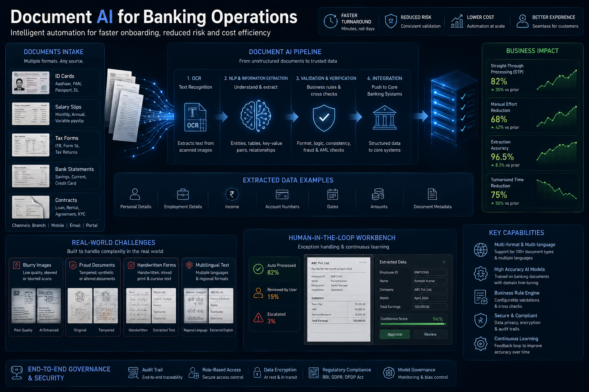

## Copy-Ready Prompt

```text
Create a premium consulting-style AI-generated banking transformation slide.

TITLE:
AI Copilot for Call Centers

STYLE:
- McKinsey-style executive storytelling
- Dark premium banking aesthetic
- Cyan and electric-blue enterprise AI glow
- Modern system-design visual language
- 16:9 widescreen
- Clean information hierarchy
- Professional banking realism
- Bloomberg + enterprise AI atmosphere

CORE REQUIREMENTS:
- show measurable business value
- realistic operational constraints
- production-grade AI systems
- executive-ready visual storytelling
- modern banking transformation aesthetics

VISUAL ELEMENTS:
- enterprise AI workflows
- customer intelligence systems
- decision engines
- monitoring dashboards
- intelligent automation
- risk management layers
- data pipelines
- production infrastructure

ANNOTATIONS:
- measurable ROI
- production AI
- governance
- scalability
- explainability
- operational efficiency

BOTTOM-RIGHT:
Add subtle DataLearn watermark.

FINAL FEEL:
The visual should look like it belongs inside a top-tier McKinsey, BCG, or Accenture AI transformation presentation for global banks.
```

## Executive Commentary

This use case represents a major transformation opportunity for banks seeking to become more data-driven, intelligent, scalable, and operationally resilient. Successful implementation requires:
- strong data foundations
- business sponsorship
- MLOps maturity
- governance frameworks
- continuous monitoring
- measurable KPI ownership

Typical enterprise KPIs include:
- revenue uplift
- fraud reduction
- lower operational cost
- faster decision-making
- improved customer experience
- better portfolio quality


---

# Slide 14 — Enterprise Banking Knowledge Assistant

## Section
Operations & AI Automation

## Purpose
This slide illustrates a practical enterprise AI use case used by modern financial institutions to improve operational efficiency, customer intelligence, risk management, or strategic decision-making.

## Recommended Visual Goal
Create a boardroom-quality consulting visual that combines:
- business storytelling
- AI architecture thinking
- measurable business outcomes
- operational realism
- enterprise banking aesthetics

## Suggested Image File
```text
images/ai_banking_use_cases_14.png
```

## Image Placeholder

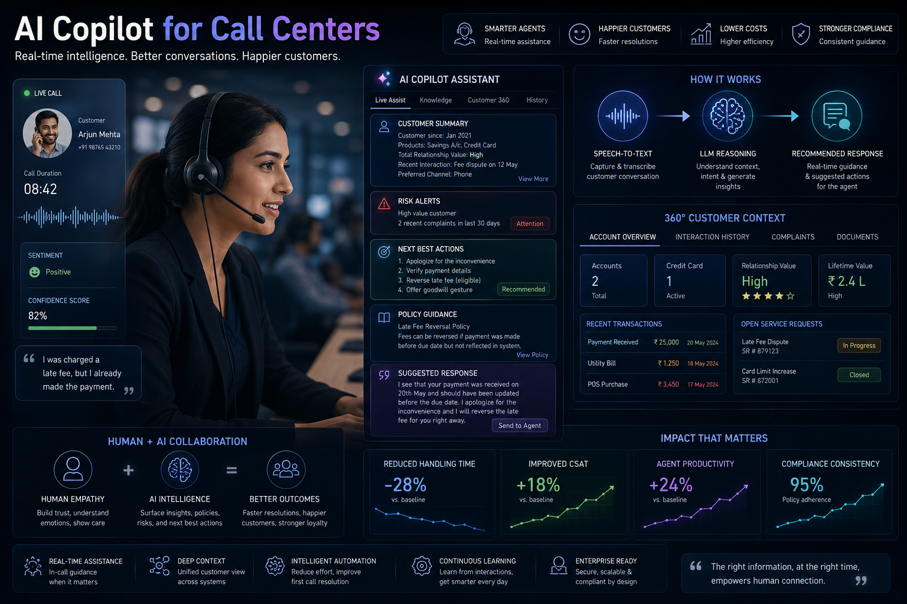

## Copy-Ready Prompt

```text
Create a premium consulting-style AI-generated banking transformation slide.

TITLE:
Enterprise Banking Knowledge Assistant

STYLE:
- McKinsey-style executive storytelling
- Dark premium banking aesthetic
- Cyan and electric-blue enterprise AI glow
- Modern system-design visual language
- 16:9 widescreen
- Clean information hierarchy
- Professional banking realism
- Bloomberg + enterprise AI atmosphere

CORE REQUIREMENTS:
- show measurable business value
- realistic operational constraints
- production-grade AI systems
- executive-ready visual storytelling
- modern banking transformation aesthetics

VISUAL ELEMENTS:
- enterprise AI workflows
- customer intelligence systems
- decision engines
- monitoring dashboards
- intelligent automation
- risk management layers
- data pipelines
- production infrastructure

ANNOTATIONS:
- measurable ROI
- production AI
- governance
- scalability
- explainability
- operational efficiency

BOTTOM-RIGHT:
Add subtle DataLearn watermark.

FINAL FEEL:
The visual should look like it belongs inside a top-tier McKinsey, BCG, or Accenture AI transformation presentation for global banks.
```

## Executive Commentary

This use case represents a major transformation opportunity for banks seeking to become more data-driven, intelligent, scalable, and operationally resilient. Successful implementation requires:
- strong data foundations
- business sponsorship
- MLOps maturity
- governance frameworks
- continuous monitoring
- measurable KPI ownership

Typical enterprise KPIs include:
- revenue uplift
- fraud reduction
- lower operational cost
- faster decision-making
- improved customer experience
- better portfolio quality


---

# Slide 15 — Real-Time Market Risk Monitoring

## Section
Treasury & Capital Markets

## Purpose
This slide illustrates a practical enterprise AI use case used by modern financial institutions to improve operational efficiency, customer intelligence, risk management, or strategic decision-making.

## Recommended Visual Goal
Create a boardroom-quality consulting visual that combines:
- business storytelling
- AI architecture thinking
- measurable business outcomes
- operational realism
- enterprise banking aesthetics

## Suggested Image File
```text
images/ai_banking_use_cases_15.png
```

## Image Placeholder

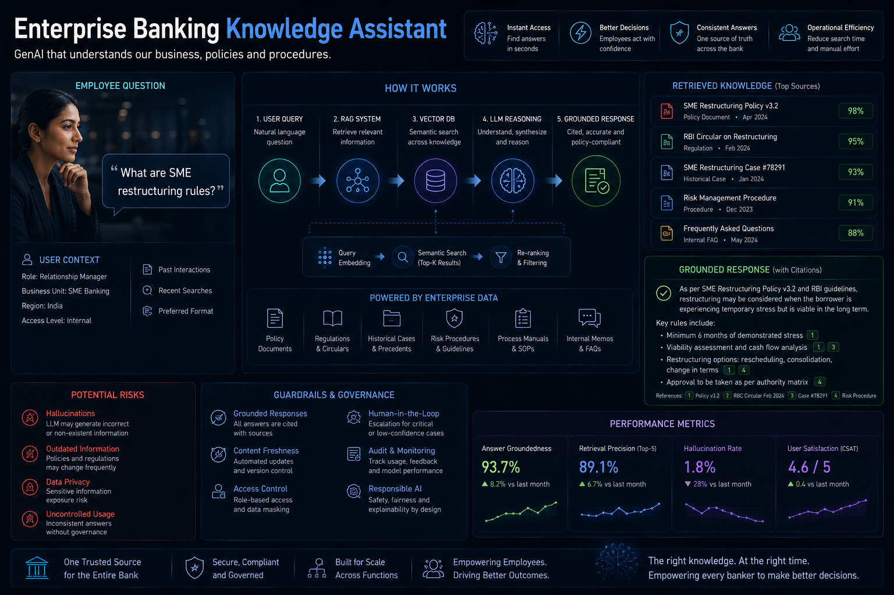

## Copy-Ready Prompt

```text
Create a premium consulting-style AI-generated banking transformation slide.

TITLE:
Real-Time Market Risk Monitoring

STYLE:
- McKinsey-style executive storytelling
- Dark premium banking aesthetic
- Cyan and electric-blue enterprise AI glow
- Modern system-design visual language
- 16:9 widescreen
- Clean information hierarchy
- Professional banking realism
- Bloomberg + enterprise AI atmosphere

CORE REQUIREMENTS:
- show measurable business value
- realistic operational constraints
- production-grade AI systems
- executive-ready visual storytelling
- modern banking transformation aesthetics

VISUAL ELEMENTS:
- enterprise AI workflows
- customer intelligence systems
- decision engines
- monitoring dashboards
- intelligent automation
- risk management layers
- data pipelines
- production infrastructure

ANNOTATIONS:
- measurable ROI
- production AI
- governance
- scalability
- explainability
- operational efficiency

BOTTOM-RIGHT:
Add subtle DataLearn watermark.

FINAL FEEL:
The visual should look like it belongs inside a top-tier McKinsey, BCG, or Accenture AI transformation presentation for global banks.
```

## Executive Commentary

This use case represents a major transformation opportunity for banks seeking to become more data-driven, intelligent, scalable, and operationally resilient. Successful implementation requires:
- strong data foundations
- business sponsorship
- MLOps maturity
- governance frameworks
- continuous monitoring
- measurable KPI ownership

Typical enterprise KPIs include:
- revenue uplift
- fraud reduction
- lower operational cost
- faster decision-making
- improved customer experience
- better portfolio quality


---

# Slide 16 — Liquidity Forecasting with Machine Learning

## Section
Treasury & Capital Markets

## Purpose
This slide illustrates a practical enterprise AI use case used by modern financial institutions to improve operational efficiency, customer intelligence, risk management, or strategic decision-making.

## Recommended Visual Goal
Create a boardroom-quality consulting visual that combines:
- business storytelling
- AI architecture thinking
- measurable business outcomes
- operational realism
- enterprise banking aesthetics

## Suggested Image File
```text
images/ai_banking_use_cases_16.png
```

## Image Placeholder

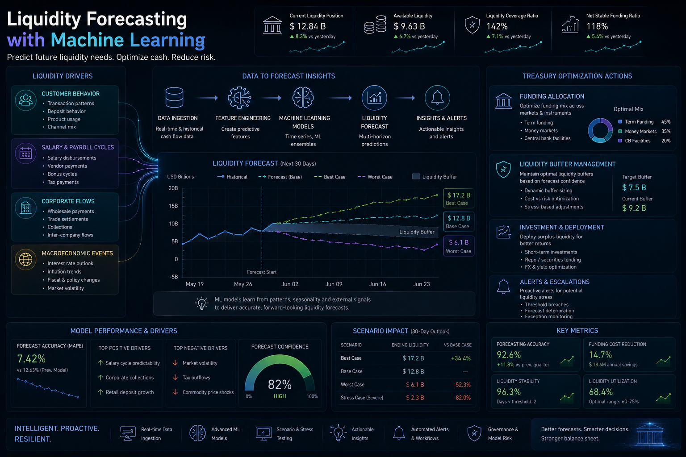

## Copy-Ready Prompt

```text
Create a premium consulting-style AI-generated banking transformation slide.

TITLE:
Liquidity Forecasting with Machine Learning

STYLE:
- McKinsey-style executive storytelling
- Dark premium banking aesthetic
- Cyan and electric-blue enterprise AI glow
- Modern system-design visual language
- 16:9 widescreen
- Clean information hierarchy
- Professional banking realism
- Bloomberg + enterprise AI atmosphere

CORE REQUIREMENTS:
- show measurable business value
- realistic operational constraints
- production-grade AI systems
- executive-ready visual storytelling
- modern banking transformation aesthetics

VISUAL ELEMENTS:
- enterprise AI workflows
- customer intelligence systems
- decision engines
- monitoring dashboards
- intelligent automation
- risk management layers
- data pipelines
- production infrastructure

ANNOTATIONS:
- measurable ROI
- production AI
- governance
- scalability
- explainability
- operational efficiency

BOTTOM-RIGHT:
Add subtle DataLearn watermark.

FINAL FEEL:
The visual should look like it belongs inside a top-tier McKinsey, BCG, or Accenture AI transformation presentation for global banks.
```

## Executive Commentary

This use case represents a major transformation opportunity for banks seeking to become more data-driven, intelligent, scalable, and operationally resilient. Successful implementation requires:
- strong data foundations
- business sponsorship
- MLOps maturity
- governance frameworks
- continuous monitoring
- measurable KPI ownership

Typical enterprise KPIs include:
- revenue uplift
- fraud reduction
- lower operational cost
- faster decision-making
- improved customer experience
- better portfolio quality


---

# Slide 17 — Model Risk Management for AI Systems

## Section
AI Governance & MRM

## Purpose
This slide illustrates a practical enterprise AI use case used by modern financial institutions to improve operational efficiency, customer intelligence, risk management, or strategic decision-making.

## Recommended Visual Goal
Create a boardroom-quality consulting visual that combines:
- business storytelling
- AI architecture thinking
- measurable business outcomes
- operational realism
- enterprise banking aesthetics

## Suggested Image File
```text
images/ai_banking_use_cases_17.png
```

## Image Placeholder


## Copy-Ready Prompt

```text
Create a premium consulting-style AI-generated banking transformation slide.

TITLE:
Model Risk Management for AI Systems

STYLE:
- McKinsey-style executive storytelling
- Dark premium banking aesthetic
- Cyan and electric-blue enterprise AI glow
- Modern system-design visual language
- 16:9 widescreen
- Clean information hierarchy
- Professional banking realism
- Bloomberg + enterprise AI atmosphere

CORE REQUIREMENTS:
- show measurable business value
- realistic operational constraints
- production-grade AI systems
- executive-ready visual storytelling
- modern banking transformation aesthetics

VISUAL ELEMENTS:
- enterprise AI workflows
- customer intelligence systems
- decision engines
- monitoring dashboards
- intelligent automation
- risk management layers
- data pipelines
- production infrastructure

ANNOTATIONS:
- measurable ROI
- production AI
- governance
- scalability
- explainability
- operational efficiency

BOTTOM-RIGHT:
Add subtle DataLearn watermark.

FINAL FEEL:
The visual should look like it belongs inside a top-tier McKinsey, BCG, or Accenture AI transformation presentation for global banks.
```

## Executive Commentary

This use case represents a major transformation opportunity for banks seeking to become more data-driven, intelligent, scalable, and operationally resilient. Successful implementation requires:
- strong data foundations
- business sponsorship
- MLOps maturity
- governance frameworks
- continuous monitoring
- measurable KPI ownership

Typical enterprise KPIs include:
- revenue uplift
- fraud reduction
- lower operational cost
- faster decision-making
- improved customer experience
- better portfolio quality


---

# Slide 18 — Evaluating LLM Systems in Banking

## Section
AI Governance & MRM

## Purpose
This slide illustrates a practical enterprise AI use case used by modern financial institutions to improve operational efficiency, customer intelligence, risk management, or strategic decision-making.

## Recommended Visual Goal
Create a boardroom-quality consulting visual that combines:
- business storytelling
- AI architecture thinking
- measurable business outcomes
- operational realism
- enterprise banking aesthetics

## Suggested Image File
```text
images/ai_banking_use_cases_18.png
```

## Image Placeholder

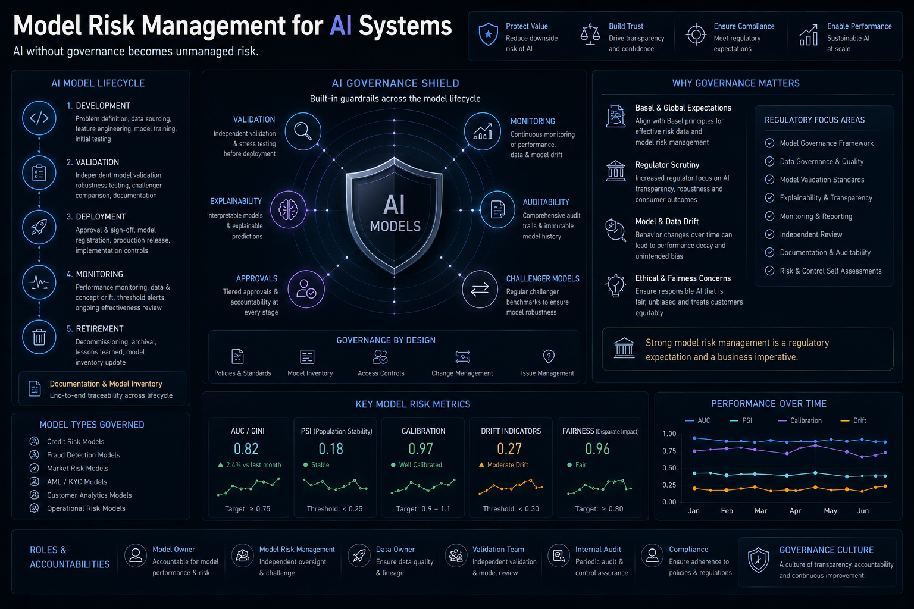

## Copy-Ready Prompt

```text
Create a premium consulting-style AI-generated banking transformation slide.

TITLE:
Evaluating LLM Systems in Banking

STYLE:
- McKinsey-style executive storytelling
- Dark premium banking aesthetic
- Cyan and electric-blue enterprise AI glow
- Modern system-design visual language
- 16:9 widescreen
- Clean information hierarchy
- Professional banking realism
- Bloomberg + enterprise AI atmosphere

CORE REQUIREMENTS:
- show measurable business value
- realistic operational constraints
- production-grade AI systems
- executive-ready visual storytelling
- modern banking transformation aesthetics

VISUAL ELEMENTS:
- enterprise AI workflows
- customer intelligence systems
- decision engines
- monitoring dashboards
- intelligent automation
- risk management layers
- data pipelines
- production infrastructure

ANNOTATIONS:
- measurable ROI
- production AI
- governance
- scalability
- explainability
- operational efficiency

BOTTOM-RIGHT:
Add subtle DataLearn watermark.

FINAL FEEL:
The visual should look like it belongs inside a top-tier McKinsey, BCG, or Accenture AI transformation presentation for global banks.
```

## Executive Commentary

This use case represents a major transformation opportunity for banks seeking to become more data-driven, intelligent, scalable, and operationally resilient. Successful implementation requires:
- strong data foundations
- business sponsorship
- MLOps maturity
- governance frameworks
- continuous monitoring
- measurable KPI ownership

Typical enterprise KPIs include:
- revenue uplift
- fraud reduction
- lower operational cost
- faster decision-making
- improved customer experience
- better portfolio quality


---

# Slide 19 — How Banks Actually Scale AI

## Section
Enterprise AI Transformation

## Purpose
This slide illustrates a practical enterprise AI use case used by modern financial institutions to improve operational efficiency, customer intelligence, risk management, or strategic decision-making.

## Recommended Visual Goal
Create a boardroom-quality consulting visual that combines:
- business storytelling
- AI architecture thinking
- measurable business outcomes
- operational realism
- enterprise banking aesthetics

## Suggested Image File
```text
images/ai_banking_use_cases_19.png
```

## Image Placeholder


## Copy-Ready Prompt

```text
Create a premium consulting-style AI-generated banking transformation slide.

TITLE:
How Banks Actually Scale AI

STYLE:
- McKinsey-style executive storytelling
- Dark premium banking aesthetic
- Cyan and electric-blue enterprise AI glow
- Modern system-design visual language
- 16:9 widescreen
- Clean information hierarchy
- Professional banking realism
- Bloomberg + enterprise AI atmosphere

CORE REQUIREMENTS:
- show measurable business value
- realistic operational constraints
- production-grade AI systems
- executive-ready visual storytelling
- modern banking transformation aesthetics

VISUAL ELEMENTS:
- enterprise AI workflows
- customer intelligence systems
- decision engines
- monitoring dashboards
- intelligent automation
- risk management layers
- data pipelines
- production infrastructure

ANNOTATIONS:
- measurable ROI
- production AI
- governance
- scalability
- explainability
- operational efficiency

BOTTOM-RIGHT:
Add subtle DataLearn watermark.

FINAL FEEL:
The visual should look like it belongs inside a top-tier McKinsey, BCG, or Accenture AI transformation presentation for global banks.
```

## Executive Commentary

This use case represents a major transformation opportunity for banks seeking to become more data-driven, intelligent, scalable, and operationally resilient. Successful implementation requires:
- strong data foundations
- business sponsorship
- MLOps maturity
- governance frameworks
- continuous monitoring
- measurable KPI ownership

Typical enterprise KPIs include:
- revenue uplift
- fraud reduction
- lower operational cost
- faster decision-making
- improved customer experience
- better portfolio quality


---

# Slide 20 — The AI-Native Bank

## Section
Enterprise AI Transformation

## Purpose
This slide illustrates a practical enterprise AI use case used by modern financial institutions to improve operational efficiency, customer intelligence, risk management, or strategic decision-making.

## Recommended Visual Goal
Create a boardroom-quality consulting visual that combines:
- business storytelling
- AI architecture thinking
- measurable business outcomes
- operational realism
- enterprise banking aesthetics

## Suggested Image File
```text
images/ai_banking_use_cases_20.png
```

## Image Placeholder

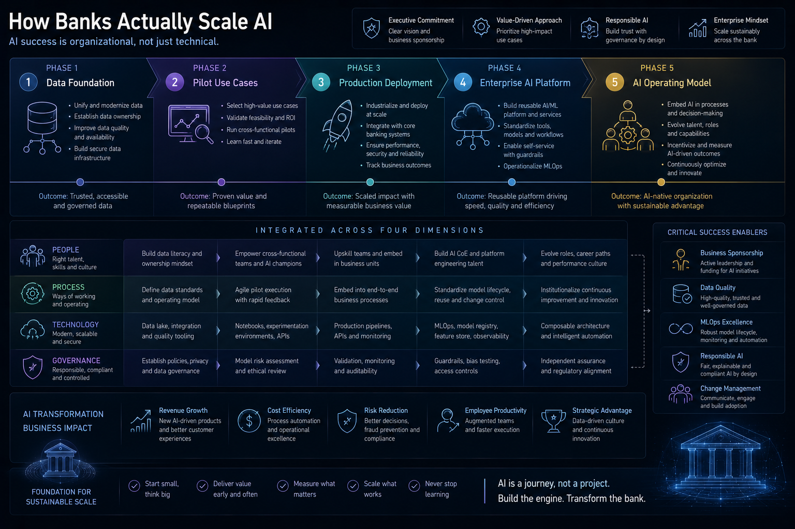

## Copy-Ready Prompt

```text
Create a premium consulting-style AI-generated banking transformation slide.

TITLE:
The AI-Native Bank

STYLE:
- McKinsey-style executive storytelling
- Dark premium banking aesthetic
- Cyan and electric-blue enterprise AI glow
- Modern system-design visual language
- 16:9 widescreen
- Clean information hierarchy
- Professional banking realism
- Bloomberg + enterprise AI atmosphere

CORE REQUIREMENTS:
- show measurable business value
- realistic operational constraints
- production-grade AI systems
- executive-ready visual storytelling
- modern banking transformation aesthetics

VISUAL ELEMENTS:
- enterprise AI workflows
- customer intelligence systems
- decision engines
- monitoring dashboards
- intelligent automation
- risk management layers
- data pipelines
- production infrastructure

ANNOTATIONS:
- measurable ROI
- production AI
- governance
- scalability
- explainability
- operational efficiency

BOTTOM-RIGHT:
Add subtle DataLearn watermark.

FINAL FEEL:
The visual should look like it belongs inside a top-tier McKinsey, BCG, or Accenture AI transformation presentation for global banks.
```

## Executive Commentary

This use case represents a major transformation opportunity for banks seeking to become more data-driven, intelligent, scalable, and operationally resilient. Successful implementation requires:
- strong data foundations
- business sponsorship
- MLOps maturity
- governance frameworks
- continuous monitoring
- measurable KPI ownership

Typical enterprise KPIs include:
- revenue uplift
- fraud reduction
- lower operational cost
- faster decision-making
- improved customer experience
- better portfolio quality


---

# Closing Perspective

The future of banking will not be defined solely by digitization.

It will be defined by:
- intelligent decision systems
- real-time analytics
- enterprise AI governance
- scalable machine learning operations
- customer-centric personalization
- AI-native operating models

Banks that successfully combine:
- data
- AI
- governance
- business execution
- organizational transformation

will become the next generation of intelligent financial institutions.

---

# Final Executive Message

> “The future bank is not digital-first.  
> It is intelligence-first.”

---

# DataLearn

Turn Data Into Decisions
